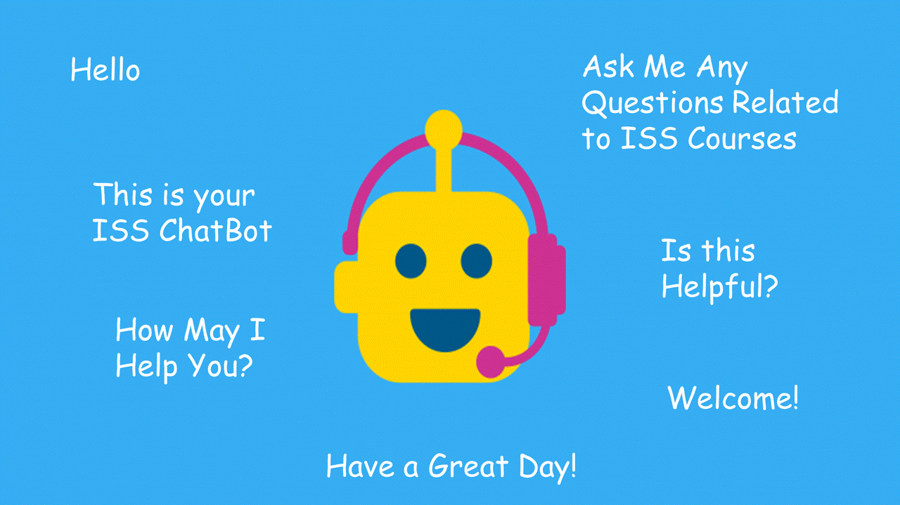

## SECTION 1 : PROJECT TITLE
## ISS ChatBot

---
## SECTION 2 : EXECUTIVE SUMMARY / PAPER ABSTRACT
In this project, we are tasked to build a chatbot system for the ISS website. The purpose of this chatbot would be to answer enquiries related to ISS programs, courses, and related information. This project serves to leverage the techniques learned in the Cognitive Systems course.
We employed the Dialogflow agent for this implementation together with a Python program and its associated libraries. This combination provides the capability for two levels of response, first is a fulfillment from the Python program, and second is Dialogflow. 
This project gives the team an opportunity to convert our learning into practical use. In this case, providing a way for users to interactively use the ISS website.

---
## SECTION 3 : CREDITS / PROJECT CONTRIBUTION

| Official Full Name  | Student ID (MTech Applicable)  | Work Items (Who Did What) | Email (Optional) |
| :------------ |:---------------:| :-----| :-----|
| CAO LIANG            | A0012884E | Architect, Python Library, JSON Files, and Integration                   | e0384184@u.nus.edu |
| GENG LIANGYU         | A0195278M | Web Deployment using Heroku, GUI creation                                | e0384909@u.nus.edu |
| HAN DONGCHOU FRANCIS | A0195414A | Team Lead, Documentation, and Submission                                 | e0385045@u.nus.edu |
| ONG BOON PING        | A0195172B | DialogFlow Setup, Python main program                                    | e0384803@u.nus.edu |
| TAN CHIN GEE         | A0195296M | DialogFlow Configuration, Testing and Documentation                      | e0384927@u.nus.edu |

---
## SECTION 4 : VIDEO OF SYSTEM MODELLING & USE CASE DEMO

[Introduction Video](https://youtu.be/RXYVsCB5vHU)

---
## SECTION 5 : USER GUIDE

`<Github File Link>` : <https://github.com/francis-han/IRS-RS-2019-03-09-IS1PT-GRP-Pepper-PatientMatchingSystem/blob/master/UserGuide/Users%20Manual_Patient%20Matching.docx>

### [ * ] In order to run the system, you need Java 8 or later version.

> Download this file from https://github.com/francis-han/IRS-RS-2019-03-09-IS1PT-GRP-Pepper-PatientMatchingSystem/tree/master/SystemCodes/Submission/IRS-RS-2019-03-09-IS1PT-GRP-Pepper-PatientMatchingSystem.zip

> The file contains both executable jar and db files.

> Unzip the zip file, there will be a folder named "rs-patient-matching" generated.

> Open cmd/bash window, go to the above "rs-patient-matching" folder, eg: cd C:\Users\ Desktop\rs-patient-matching\

> Run command: java -jar rs-patient-matching-0.1.0.jar

> Open link: http://localhost:8090/ in browser.

> To run our system, type the command “java -jar rs-patient-matching-0.1.0.jar”.

> **Open your preferred browser and go to the URL** “http://localhost:8090/”

---
## SECTION 6 : PROJECT REPORT / PAPER

`<Github File Link>` : <https://github.com/francis-han/IRS-RS-2019-03-09-IS1PT-GRP-Pepper-PatientMatchingSystem/blob/master/ProjectReport/Project%20Report%20V2.pdf>

---
## SECTION 7 : MISCELLANEOUS

### Test Scenario

